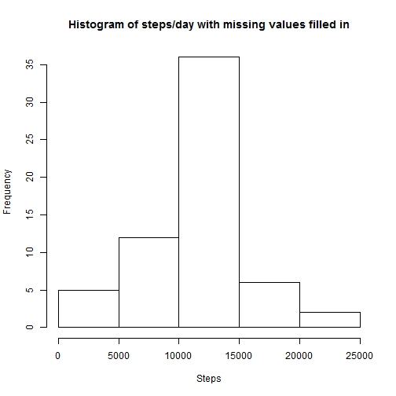

# Reproducible Research: Peer Assessment 1
========================================================

## Loading and preprocessing the data

```r
setwd("C:\\git\\RepData_PeerAssessment1")
library(knitr)

# Unzip the activity file (if necessary):
zipFileName <- "activity.zip"
fileName <- "activity.csv"
if(!file.exists(fileName)) unzip(zipFileName)

# Load file contents into R:
df <- read.csv(fileName)
dim(df)
```

```
## [1] 17568     3
```

```r
head(df)
```

```
##   steps       date interval
## 1    NA 2012-10-01        0
## 2    NA 2012-10-01        5
## 3    NA 2012-10-01       10
## 4    NA 2012-10-01       15
## 5    NA 2012-10-01       20
## 6    NA 2012-10-01       25
```


## What is mean total number of steps taken per day?

```r
# Remove NAs:
df1 <- df[complete.cases(df$steps),]

## Make a histogram of the total number of steps taken each day:
stepsPerDay <- aggregate(df1$steps, by=list(df1$date), FUN=sum, simplify=F)
colnames(stepsPerDay) <- c("date", "steps.total")
stepsPerDay$steps.total <- as.numeric(stepsPerDay$steps.total)
hist(stepsPerDay$steps.total, main="Histogram of steps/day", xlab="Steps")
```

 

```r
# Calculate and report the mean and median total number of steps taken per day:
mean(stepsPerDay$steps.total)
```

```
## [1] 10766
```

```r
median(stepsPerDay$steps.total)
```

```
## [1] 10765
```


## What is the average daily activity pattern?

```r
## Make a time series plot (i.e. type = "l") of the 5-minute interval (x-axis) and the average number of steps taken, averaged across all days (y-axis):
r <- aggregate(df1$steps, by=list(df1$interval), FUN=mean)
colnames(r) <- c("interval", "average.steps.taken")
library(ggplot2)

g <- ggplot(r, aes(interval, average.steps.taken))
g <- g + geom_point(color="blue")
g <- g + geom_line(color="blue")
g <- g + labs(y="average steps", x="minute of the day (in 5-minute intervals)")
g <- g + opts(title = "Average steps over 5-minute intervals during the day")
```

```
## 'opts' is deprecated. Use 'theme' instead. (Deprecated; last used in version 0.9.1)
## Setting the plot title with opts(title="...") is deprecated.
##  Use labs(title="...") or ggtitle("...") instead. (Deprecated; last used in version 0.9.1)
```

```r
print(g)
```

 

```r
## Which 5-minute interval, on average across all the days in the dataset, contains the maximum number of steps?:
r[which.max(r[,2]),1]
```

```
## [1] 835
```


## Inputing missing values
I chose to use the mean value for the day as a filler for missing values in my dataset.
Based on this strategy, the mean value remains unchanged (before vs. after), while median value changes slightly to match the median perfectly.

```r
## Calculate and report the total number of missing values in the dataset (i.e. the total number of rows with NAs):
numberOfNAs <- dim(df[complete.cases(df)==F,])[1]
numberOfNAs
```

```
## [1] 2304
```

```r
## Devise a strategy for filling in all of the missing values in the dataset.
## The strategy does not need to be sophisticated.
## For example, you could use the mean/median for that day, or the mean for that 5-minute interval, etc.
## I will use the mean for that day.

## Create a new dataset that is equal to the original dataset but with the missing data filled in:
df2 <- df
for(i in 1:nrow(df2)){
    if(is.na(df2[i,1])) df2[i,1] <- r[r$interval == df2[i,3],2]
}

## Make a histogram of the total number of steps taken each day and Calculate and report the mean and median total number of steps taken per day. Do these values differ from the estimates from the first part of the assignment? What is the impact of imputing missing data on the estimates of the total daily number of steps?
stepsPerDay2 <- aggregate(df2$steps, by=list(df2$date), FUN=sum, simplify=F)
colnames(stepsPerDay2) <- c("date", "steps.total")
stepsPerDay2$steps.total <- as.numeric(stepsPerDay2$steps.total)
hist(stepsPerDay2$steps.total, main="Histogram of steps/day with missing values filled in", xlab="Steps")
```

 

```r
# Find out the mean and median:
mean(stepsPerDay2$steps.total)
```

```
## [1] 10766
```

```r
median(stepsPerDay2$steps.total)
```

```
## [1] 10766
```


## Are there differences in activity patterns between weekdays and weekends?
The general trend with activity pattern on weekdays vs. weekends seems to be higher level of activity (more steps) during the first part of the day on weekdays (500-1000 minute interval of the day). This is evident in both higher maximum values, as well as higher sustained activity level overall. During the weekends, higher activity is observed in the second half of the day (1000-2100 minute interval of the day).

```r
## Create a new factor variable in the dataset with two levels - "weekday" and "weekend" indicating whether a given date is a weekday or weekend day:
df2$week.day.end <- factor(
    sapply(weekdays(as.Date(levels(df2$date)[df2$date])), switch,
        Monday="weekday", Tuesday="weekday", Wednesday="weekday", Thursday="weekday",
        Friday="weekday", Saturday="weekend", Sunday="weekend"),
    c("weekday", "weekend")
)

weekdf <- aggregate(df2$steps, by=list(df2$interval, df2$week.day.end), FUN=mean, simplify=F)
colnames(weekdf) <- c("interval", "week.day.end", "average.steps")
weekdf$average.steps <- unlist(weekdf$average.steps)


g <- qplot(interval, average.steps, data=weekdf, facets = week.day.end ~ .)
g <- g + geom_line()
g <- g + labs(x="Interval", y="Number of steps")
g <- g + opts(title = "Steps over 5-minute interval by weekday/weekend")
```

```
## 'opts' is deprecated. Use 'theme' instead. (Deprecated; last used in version 0.9.1)
## Setting the plot title with opts(title="...") is deprecated.
##  Use labs(title="...") or ggtitle("...") instead. (Deprecated; last used in version 0.9.1)
```

```r
print(g)
```

 
